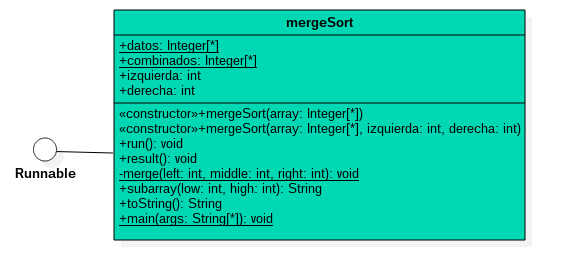
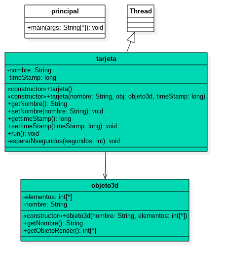
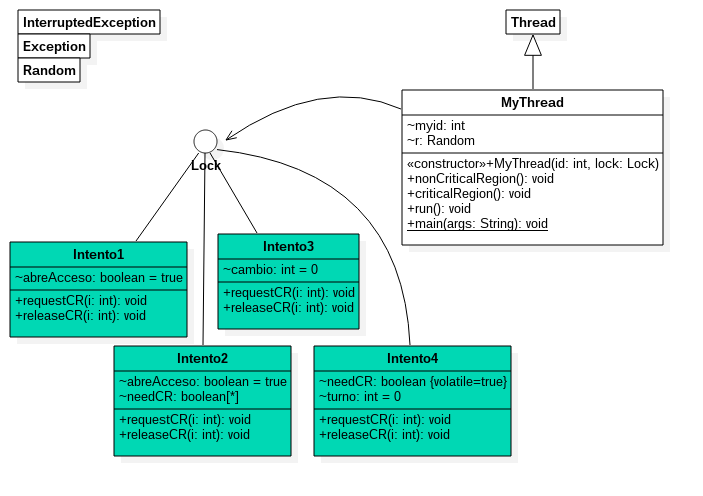
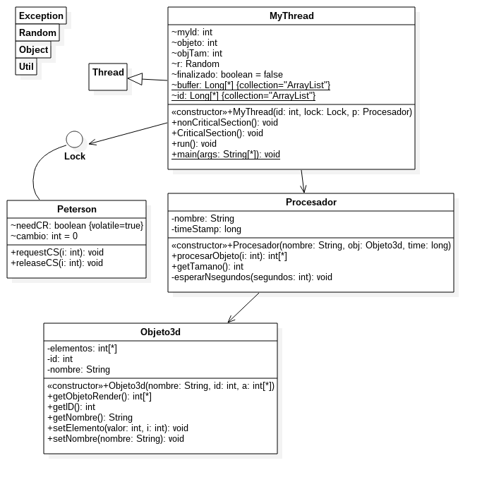

# Cómputo Distribuido

La exclusión mutua es un programa que previene el acceso simultáneo a un recurso compartido. Este concepto es un utilizado en la programación concurrente con una región crítica, un espacio del código en el que los hilos o procesos acceden a un recurso compartido. Cuando un hilo tiene un recurso, éste se bloquea previniendo el acceso concurrente al recurso.

En otras palabras, la exclusión mutua actua como una herramienta de bloqueo y sincronización. Cuando un hilo intenta ingresar en la región crítica, se le permite si está disponible, de otra manera, el hilo se pone en *suspensión*(sleep).

Práctica 4
----------

Codifica un programa multi-hilo en Java que ordene un arreglo usando el método recursivo mergesort. El hilo principal bifurca dos hilos para ordenar las dos mitades del arreglo, que posteriormente serán ordenados.

```Java
public class mergeSort implements Runnable {
  public static Integer[] datos;
  public static Integer[] combinados;
  public int izquierda, derecha;
  public mergeSort( Integer[] array) {
    this.datos = array;
    this.combinados = new Integer[datos.length];
    izquierda = 0;
    derecha = array.length - 1;
  }
  public mergeSort( Integer[] array, int izquierda, int derecha) {
    this.datos = array;
    this.combinados = new Integer[datos.length];
    this.izquierda = izquierda;
    this.derecha = derecha;
  }
  public void run() {
    if( izquierda < derecha) {
      int middle1 = (izquierda + derecha)/2;
      int middle2 = middle1+1;
            mergeSort ms1 = new mergeSort(datos, izquierda, middle1);
            mergeSort ms2 = new mergeSort(datos, middle2, derecha);
            System.out.println("\n PID: " + Thread.currentThread().getId() + " Hilo 1");
            System.out.println("\n PID: " + Thread.currentThread().getId() + " Hilo 2");
            Thread hilo1 = new Thread(ms1);
            Thread hilo2 = new Thread(ms2);
            hilo1.start();
            hilo2.start();
          try{
              hilo1.join();
              hilo2.join();
          }
          catch(InterruptedException e){}
      merge(izquierda, middle2, derecha);
    }
  }
  public void result() {
    for(int k=0; k < datos.length ; k++ )
      System.out.print( datos[k] + " ");
  }
  private static void merge(int left, int middle, int right) {
    int finIzquierda = middle - 1;
    int k = left;
    int num = right - left + 1;
    while(left <= finIzquierda && middle <= right) {
      if(datos[left].compareTo(datos[middle]) <= 0) {
        combinados[k++] = datos[left++];
      }
      else {
          combinados[k++] = datos[middle++];
      }
    }
    while(left <= finIzquierda) {
      combinados[k++] = datos[left++];
    }
    while(middle <= right){
      combinados[k++] = datos[middle++];
    }
    for(int i = 0; i < num; i++, right--) {
      datos[right] = combinados[right];
    }
  }
  public String subarray( int low, int high) {
    StringBuilder temporary = new StringBuilder();
    for( int i=0; i < low; i++)
      temporary.append(" ");
    for( int i = low; i <= high; i++)
      temporary.append("  " + datos[i]);
    return temporary.toString();
  }
  public String toString(){
    return subarray(0, datos.length-1);
  }

public static void main (String[] args)
  {
    Integer[] datos = new Integer [7];
    int longitud = datos.length;
    Random generator = new Random();
    for(int i=0; i < longitud; i++)
      datos[i] = 10 + generator.nextInt(90);
    System.out.println("Desordenado: " );
    for(int k=0; k < longitud ; k++ )
      System.out.print( datos[k] + " ");
    mergeSort merge = new mergeSort(datos);
    merge.run();
    System.out.print("\nOrdenado: ");
    merge.result();
  }
}
```


Practica 5
----------

El objetivo es simular el proceso de renderizado de una escena 3D.
Una escena contiene múltiples objetos 3D complejos.
Una tarjeta de video estándar hace los cálculos correspondientes para mostrarlos en pantalla, procesándolos uno a uno con el hardware que posee.
De este modo la tarjeta debe de procesar los vértices, polígonos y demás elementos, es decir, primero se procesa el objeto 1, luego el objeto 2, etc.
Para ello vamos a definir una clase **Tarjeta** y una clase **Objeto3d** la cual tendrá un **arreglo de enteros** que representaran los elementos (vértices, polígonos, normales, etc.) y el tiempo que la tarjeta tardará en procesar el objeto con su hardware.

Un arreglo con [3, 2, 6] significa que un objeto tiene 3 elementos que procesar y que la tarjeta tardará en procesar cada elemento en 3 segundos, 2 segundos y 6 segundos respectivamente con lo cual tardara en total 11 segundos.

Revisa el código adjunto y completa los métodos que hagan falta. Una vez hecho eso pruébalo.


```Java
public class principal {
  public static void main(String[] args) {
    objeto3d Objeto3d1 = new objeto3d("Objeto3d 1", new int[] { 2, 7, 1, 5, 8, 3, 7 });
    objeto3d Objeto3d2 = new objeto3d("Objeto3d 2", new int[] { 5, 3, 5, 9, 1, 3 });

    tarjeta tarjeta1 = new tarjeta("Tarjeta 1");
    tarjeta tarjeta2 = new tarjeta("Tarjeta 2");

    // Tiempo inicial de referencia
    long initialTime = System.currentTimeMillis();

    tarjeta1.procesarObjeto(Objeto3d1, initialTime);
    tarjeta2.procesarObjeto(Objeto3d2, initialTime);
  }
}
public class tarjeta {
  private String nombre
        public tarjeta(String nombre){
            this.nombre = nombre;
        }
  public void procesarObjeto(objeto3d obj, long timeStamp) {

    System.out.println("TARJETA: " + this.nombre + 
        "\nCOMIENZA A PROCESAR AL OBJETO: " + obj.getNombre() + 
        "\nTIEMPO: " + (System.currentTimeMillis() - timeStamp) / 1000+ "seg");

    for (int i = 0; i < obj.getObjetoRender().length; i++) { 
      this.esperarNsegundos(obj.getObjetoRender()[i]); 
      System.out.println("Objeto " + (i + 1) + " PROCESADO " +  
    "\nTiempo: " + (System.currentTimeMillis() - timeStamp) / 1000 +"segundos");
    }
      System.out.println("TARJETA: " + this.nombre + " HA COMPLETADO EL PROCESAMIENTO " + obj.getNombre() + " EN TIEMPO: " + (System.currentTimeMillis() - timeStamp) / 1000 + "seggundos");
  }
private void esperarNsegundos(int segundos) {
    try {
      Thread.sleep(segundos * 1000);
    } catch (InterruptedException ex) {
      Thread.currentThread().interrupt();
    }
  }

}
public class objeto3d 
{
  private int[] elementos;
  private String nombre;

        public objeto3d(String nombre, int[] elementos){
            this.nombre = nombre;
            this.elementos = elementos;
        }
        public String getNombre(){
            return nombre;
        }
        public int [] getObjetoRender(){
            return  elementos;
        }
}
```

Has una copia del programa y modifícalo para que ahora trabaje con hilos, donde la clase Tarjeta herede de Thread, y por lo tanto el tiempo de procesamiento sea menor. Es decir, el funcionamiento resultante se ilustra en la siguiente imagen.

```Java
public class tarjeta extends Thread {
  private String nombre;
  private objeto3d obj;
  private long timeStamp;
  public tarjeta(String nombre, objeto3d obj, long timeStamp) {
    this.nombre = nombre;
    this.obj = obj;
    this.timeStamp = timeStamp;
  }
  public String getNombre() {
    return nombre;
  }
  public void setNombre(String nombre) {
    this.nombre = nombre;
  }
  public long gettimeStamp() {
    return timeStamp;
  }
  public void settimeStamp(long timeStamp) {
    this.timeStamp = timeStamp;
  }

public void run(){
    System.out.println("TARJETA: " + this.nombre + 
    "\nCOMIENZA A PROCESAR AL OBJETO: " + obj.getNombre() + 
    "\nTIEMPO: " + (System.currentTimeMillis() - timeStamp) / 1000  + "seg");
    for (int i = 0; i < obj.getelementos().length; i++) { 
      this.esperarNsegundos(obj.getelementos()[i]); 
      System.out.println("Objeto " + (i + 1) + " PROCESADO " +  
      "\nTiempo: " + (System.currentTimeMillis() - timeStamp) / 1000 +"segundos");
    }
System.out.println("TARJETA: " + this.nombre + " HA COMPLETADO EL PROCESAMIENTO " +obj.getNombre() + " EN TIEMPO: " + 
    (System.currentTimeMillis() - timeStamp) / 1000 + "seggundos");
  }
  private void esperarNsegundos(int segundos) {
    try {
      Thread.sleep(segundos * 1000);
    } catch (InterruptedException ex) {
      Thread.currentThread().interrupt();
    }
  }
}
public class objeto3d {
  private String nombre;
  private int[] elementos;
  public objeto3d() {
  }
  public objeto3d(String nombre, int[] elementos) {
    this.nombre = nombre;
    this.elementos = elementos;
  }
  public String getNombre() {
    return nombre;
  }
  public void setNombre(String nombre) {
    this.nombre = nombre;
  }
  public int[] getelementos() {
    return elementos;
  }
  public void setelementos(int[] elementos) {
    this.elementos = elementos;
  }
}

public class principal {
  public static void main(String[] args) {
    objeto3d objeto3d1 = new objeto3d("Objeto3d 1", new int[] { 2, 2, 1, 5, 2, 3 });
    objeto3d objeto3d2 = new objeto3d("Objeto3d 2", new int[] { 1, 3, 5, 1, 1 });
    long timeStamp = System.currentTimeMillis();
    tarjeta tarjeta1 = new tarjeta("tarjeta 1", objeto3d1, timeStamp);
    tarjeta tarjeta2 = new tarjeta("tarjeta 2", objeto3d2, timeStamp);
    tarjeta1.start();
    tarjeta2.start();
  }
}
```

Has lo mismo que el punto anterior modificando las clases o la clase que sea necesaria para que se realice lo mismo pero ahora implementado la clase Runnable.

```Java
public class objeto3d {
  private String nombre;
  private int[] elementos;
  public objeto3d(String nombre, int[] elementos) {
    this.nombre = nombre;
    this.elementos = elementos;
  }
  public String getNombre() {
    return nombre;
  }
  public void setNombre(String nombre) {
    this.nombre = nombre;
  }
  public int[] getelementos() {
    return elementos;
  }
  public void setelementos(int[] elementos) {
    this.elementos = elementos;
  }
}

public class tarjeta 
{
  private String nombre;
  public tarjeta() {
  }
  public tarjeta(String nombre) {
    this.nombre = nombre;
  }
  public String getNombre() {
    return nombre;
  }Sublic void setNombre(String nombre) {
    this.nombre = nombre;
  }

public void procesarobjeto(objeto3d obj, long timeStamp) {
    System.out.println("TARJETA: " + this.nombre + 
    "\nCOMIENZA A PROCESAR AL OBJETO: " + obj.getNombre() + 
    "\nTIEMPO: " + (System.currentTimeMillis() - timeStamp) / 1000  + "seg");
    for (int i = 0; i < obj.getelementos().length; i++) 
    { 
      this.esperarNsegundos(obj.getelementos()[i]); 
      System.out.println("Objeto " + (i + 1) + " PROCESADO " +  
    "\nTiempo: " + (System.currentTimeMillis() - timeStamp) / 1000 + "segundos");
    }
System.out.println("TARJETA: " + this.nombre + " HA COMPLETADO EL PROCESAMIENTO " + obj.getNombre() + " EN TIEMPO: " + 
(System.currentTimeMillis() - timeStamp) / 1000 + "seggundos");
  }
  private void esperarNsegundos(int segundos) {
    try {
      Thread.sleep(segundos * 1000);
    } catch (InterruptedException ex) {
      Thread.currentThread().interrupt();
    }
  }
}

public class principal implements Runnable{
  private objeto3d obj;
  private tarjeta tarjeta;
  private long timeStamp;
  public principal(objeto3d obj, tarjeta tarjeta, long timeStamp){
    this.tarjeta = tarjeta;
    this.obj = obj;
    this.timeStamp = timeStamp;
  }
  public static void main(String[] args) {  
    objeto3d objeto3d1 = new objeto3d("Objeto3d 1", new int[] { 2, 2, 1, 5, 2, 3 });
    objeto3d objeto3d2 = new objeto3d("Objeto3d 2", new int[] { 1, 3, 5, 1, 1 });
    tarjeta tarjeta1 = new tarjeta("Tarjeta 1");
    tarjeta tarjeta2 = new tarjeta("Tarjeta 2");
    long timeStamp = System.currentTimeMillis();
    Runnable proceso1 = new principal(objeto3d1, tarjeta1, timeStamp);
    Runnable proceso2 = new principal(objeto3d2, tarjeta2, timeStamp);
    new Thread(proceso1).start();
    new Thread(proceso2).start();
  }
  public void run() {
    this.tarjeta.procesarobjeto(this.obj, this.timeStamp);
  }
}
```



Practica 6
----------

En intento 1, no es posible detectar quien establece el valor falso para la variable compartida.

```Java
public class Intento1 implements Lock{
  boolean abreAcceso = true;
  public void requestCR(int i){
      while(!abreAcceso){
          abreAcceso = false;
      }
  }
  public void releaseCR(int i){
      abreAcceso = true;
  }
}
```

Intento 2 almacena para cada Pi verdadero en needCR[i] y espera a que el otro proceso sea falso.

```Java
public class Intento2 implements Lock{
  boolean abreAcceso = true;
  boolean[] needCR = {false,false};
  public void requestCR(int i){
    needCR[i]=true;
    while(needCR[1-i]){
      needCR[i] = false;
    }
  }
  public void releaseCR(int i){
    needCR[i] = false;
  }
}
```

En Intento 2, ambos procesos pueden quedarse esperando a que la CR sea liberada por el otro proceso; Intento 3 implementa una variable de cambio.

```Java
public class Intento3 implements Lock {
  int cambio = 0;
  public void requestCR( int i ) {
      while(cambio==1-i);
  }
  public void releaseCR( int i ) {
      cambio = 1-i;
  }
}
```

Intento 3 logra la exclusión mutua, pero algunas veces un hilo no puede ganar acceso a la variable compartida y no puede progresar.

```Java
public class Intento3 implements Lock {
  int cambio = 0;
  public void requestCR( int i ) {
      while(cambio==1-i);
  }
  public void releaseCR( int i ) {
      cambio = 1-i;
  }
}
```

Intento 4 combina los dos intentos anteriores, implementando las banderas needCR[] y la variable de cambio.

```Java
class Intento4 implements Lock
{
  volatile boolean needCR[] = {false,false};
  int turno = 0;
  public void requestCR( int i ) {
    int x = 1 - i;
    needCR[i]=true;
    turno = x;
    while( needCR[x] && turno == x);
  }
  public void releaseCR( int i ) {
    needCR[i] = false;
  }
}
public interface Lock {
    
    public void requestCR(int myid);
    public void releaseCR(int myid);
}
import java.util.Random;
import java.util.logging.Level;
import java.util.logging.Logger;

public class MyThread extends Thread{
    int myid;
    Lock lock;
    Random r;
    
    public MyThread(int id, Lock lock){
        myid = id;
        this.lock = lock;
        r = new Random();
    }
    public void nonCriticalRegion() throws InterruptedException{
        int rand = r.nextInt(5000);
        Thread.sleep(rand);
        System.out.println(myid + " no esta en la CR " + rand + " ms");
    }
    public void criticalRegion() throws InterruptedException{
        int rand = r.nextInt(5000);
        Thread.sleep(rand);
        System.out.println(myid + " esta en la CR " + rand + " ms");
    }
    public void run(){
        while(true){
            try {
                lock.requestCR(myid);
                criticalRegion();
                lock.releaseCR(myid);
                nonCriticalRegion();
            } catch (InterruptedException ex) {
                Logger.getLogger(MyThread.class.getName()).log(Level.SEVERE, null, ex);
            }
        }
    }
    public static void main (String args[]) throws Exception{
        MyThread t[] = new MyThread[2];
        Lock lock = new Intento4();
        for(int i=0; i<2; i++){
            t[i] = new MyThread(i, lock);
            t[i].start();
        }
    }
}
```




Practica 7
----------

1. Retomar la Práctica 05 (hilos II) y modificaciones para que funcione sólo con 2 hilos (uno por tarjeta). Utilizando toda la estructura del Algoritmo de Exclusión Mutua Intento4, junto con la clase principal MyThread hacer las siguientes mejoras:
a. . Cambiar el nombre de la clase Tarjeta por Procesador.
b.  Agregar un recurso compartido que se llame display el cual será representado con una lista y contendrá la totalidad de elementos de los dos objetos. La intención de esta lista es simular el buffer que se mostrará en pantalla una vez renderizada toda la escena.
c.  La lista display contendrá objetos de tipo elementoGrafico que posee dos atributos: idObjeto y nSegundos.
d.  La Región Crítica se encargará de insertar ordenadamente los elementos de cada objeto en la lista, por lo tanto el acceso a display debe ser atómico para cada hilo.  El orden es el siguiente: [Elementos del objeto1, Elementos del objeto 2]

```Java
public class Procesador
{
  private String nombre;
  private long timeStamp;
  private Objeto3d obj;
  public Procesador(String nombre,Objeto3d obj, long time)
  {
    this.nombre=nombre;
    this.obj=obj;
    timeStamp=time;
  }

public int[] procesarObjeto(int i) {
    int [] elemento= new int[2];
    System.out.println("TARJETA: " + this.nombre +
        "\nCOMIENZA A PROCESAR AL OBJETO: " + obj.getNombre() +
        "\nTIEMPO: " + (System.currentTimeMillis() - timeStamp) / 1000  + " seg");
      this.esperarNsegundos(obj.getObjetoRender()[i]);
      System.out.println("Objeto " + (i + 1) + " PROCESADO " +
      "\nTiempo: " + obj.getObjetoRender()[i] +   "segundos");
    if(i==obj.getObjetoRender().length-1){
System.out.println("PROCESADOR: " + this.nombre + " HA COMPLETADO EL    PROCESAMIENTO " + obj.getNombre() + " EN TIEMPO: " +
    (System.currentTimeMillis() - timeStamp) / 1000 + " segundos");
    }
    elemento[0]=obj.getID();
    elemento[1]=obj.getObjetoRender()[i];
    return elemento;
  }

public int getTamano()
  {
    return obj.getObjetoRender().length;
  }
  private void esperarNsegundos(int segundos) {
    try {
      Thread.sleep(segundos * 1000);
    } catch (InterruptedException ex) {
      Thread.currentThread().interrupt();
    }
  }
}
public class MyThread extends Thread {
    int myId;
    int objeto;
    int objTam;
    Lock lock;
    Random r;
    boolean finalizado=false;
    Procesador pro;
    static ArrayList<Long> display = new ArrayList<Long>();
    static ArrayList<Long> id= new ArrayList<Long>();

    public MyThread(int id, Lock lock, Procesador p) {
        myId = id;
        objeto=0;
        this.lock = lock;
        r= new Random();
        pro=p;
        objTam=pro.getTamano();
    }

public void nonCriticalSection() {
        System.out.println(myId + " no esta en la CR");
        objeto++;
        if(objeto==objTam)
        {
          finalizado=true;
        }
    }
    public void CriticalSection() {
      int [] arreglo;
        System.out.println(myId + " esta en la CR");
        arreglo=pro.procesarObjeto(objeto);
        System.out.println("id:"+arreglo[0]);
        System.out.println("tiempo:"+arreglo[1]);
        display.add((long) arreglo[1]);
        id.add((long) arreglo[0]);
    }
public void run() {
        while (finalizado!=true) {
            synchronized(Lock.class) {
            lock.requestCS(myId);
            CriticalSection();
            lock.releaseCS(myId);
            nonCriticalSection();}
        }
    }

public static void main(String[] args) throws Exception {
      Objeto3d Objeto3d1 = new Objeto3d("Objeto3d 1",1, new int[] { 2, 7, 1, 5, 8, 3, 7 });
  Objeto3d Objeto3d2 = new Objeto3d("Objeto3d 2",2, new int[] { 5, 3, 5, 9, 1, 3 }) 
    long initialTime = System.currentTimeMillis();
    Procesador procesador1 = new Procesador("Procesador 1",Objeto3d1,initialTime);
    Procesador procesador2 = new Procesador("Procesador 2",Objeto3d2,initialTime);
        MyThread t[];
        int N = Integer.parseInt("2");
        t = new MyThread[N];
        Lock lock = new Intento4();//or any other mutex algorithm
        t[0] = new MyThread(0, lock,procesador1);
        t[1] = new MyThread(1, lock,procesador2);
        t[0].start();
        t[1].start();
        t[0].join();
        t[1].join();
        System.out.println("Display: "+t[0].display.toString());
        System.out.println("Id's  : "+t[0].id.toString());
    }
}

public class Objeto3d 
{ private int[] elementos;
  private int id;
  private String nombre;
    public Objeto3d(String nombre,int id, int []a)  {
        this.nombre=nombre;
        this.id=id;
        elementos=a;
    }
    public int[] getObjetoRender() {
        return elementos;
    }
    public int getID(){
      return id;
    }
    public String getNombre(){
        return nombre;
    }
    public void setElemento(int valor, int i){
        elementos[i]=valor;
    }
    public void setNombre(String nombre){
        this.nombre=nombre;
    }
}
Interfaz Lock
public interface Lock {
    public void requestCS(int pid); 
    public void releaseCS(int pid);
}
```

2.  Renombra a tu clase Intento4 como PetersonAlgorithm y comprueba que las siguientes modificaciones vuelven a este algoritmo incorrecto:
a. Cualquier proceso en este algoritmo se pone a sí mismo como valor de cambio en lugar de poner el valor del otro proceso.
b.   Cualquier proceso modifica la variable cambio antes de modificar la variable needCR.
c. Realizar individualmente los dos cambios anteriores y verificar qué propiedades de las 3 revisadas en clase se cumplen.

```Java
public class PetersonAlgorithm {
  int cambio= 1;
  boolean needCR[]={false,false};
  public void requestCS(int i) 
  {
    int j = i;
                       cambio = j;
    needCR[i]=true; //Intento de entrar
    while(needCR[j]&&cambio==j);
  }
  public void releaseCS(int i) 
  {
    needCR[i]=false;  
  }
}
```

Bakery
------

```Java
class Bakery implements Lock {
    int N; // number of processes using this object
    Random ran = new Random();
    boolean[] choosing;
    int[] number;
    boolean[] inCS;
    public Bakery(int n) {
        this.N = n;
        choosing = new boolean[N];
        number = new int[N];
        inCS = new boolean[N];
        for (int i = 0; i < N; ++i) {
            choosing[i]     = false;
            number[i] = 0;
            inCS[i] = false;
        }
    }
```

1. Implementa y prueba el “Algoritmo de la panadería de Lamport”

```Java
public void requestCS(int id) {
    choosing[id] = true;
    for (int j = 0; j < N; ++j) {
            if (number[j] > number[id]) number[id] = number[j];
    }
    randomSleep(500);
    number[id] = number[id] + 1;
    choosing[id]= false;
    for (int j = 0; j < N; ++j) {
    	while (choosing[j]) {
        	System.out.print("");
        }; // process j in doorway
        while ((number[j] != 0) &&
                ((number[j] < number[id]) ||
                ((number[j] == number[id]) && j < id))){
                System.out.print(""); // busy waiting
        }
    }
    inCS[id] = true;
}

public void releaseCS(int id) {
    for (int i = 0; i < N; ++i) {
        if (i != id && inCS[i]) {
            System.out.println("DATA RACING DETECTED!");
            System.exit(0);
        }
    }
    randomSleep(100);
    inCS[id] = false;
    number[id] = 0;
    }
private void randomSleep(int time) {
	try {
    Thread.sleep(1 + ran.nextInt(time));
    }
    catch (InterruptedException e) {}
    }
}
```


Aplicaciones Mutex
==================

Actualmente existen bastantes aplicaciones que ultilzan la exclusión mutua, un ejemplo clave, son las bases de datos, que al ser recursos compartidos, es necesario hacer transacciones atomicas para evitar la pérdida de información.

En los sistemas operativos basados en UNIX los programas utilizan la exclusión mutua para detectar instancias concurrentes del mismo programa y evitar acceder a algun recurso compartido al mismo tiempo.

Los sistemas de control de versiones, como *Git*, previenen que dos usuarios modifiquen la misma versión de un archivo en paralelo, y que al momento de guardar las modificaciones, las del segundo usuario se sobreescriban en las del primero,

Conclusiones personales
=======================

La exclusión mutua, permite resolver problemas en los que es necesario utilizar recursos compartidos en implementaciones de distintos algoritmos, es muy utilizada debido a los comunes sistemas distribuidos actuales, que requieren de acceso a recursos compartidos.

Es importante comprender el funcionamiento de la exclusión mutua porque con el común uso del cómputo paralelo y concurrente, los recursos deben ser gestionados de manera cuidadosa y eficiente para procurar de manera correcta la información.