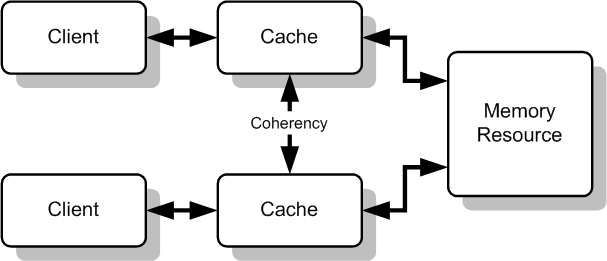

## Correción de Implementación algoritmo de Peterson

```Java
class Peterson implements Lock
{
  boolean needCR[] = {false,false};
  int turno = 0;

  public void requestCR( int i )
  {
    int x = 1 - i;
    needCR[i]=true;
    turno = x;
    while( needCR[x] && (turno == x));
  }

  public void releaseCR( int i )
  {
    needCR[i] = false;
  }
}
```

Ciertamente es posible escribir código que carga dentro de alguna "Excepción inmanejable" pero el algoritmo supone que los procesos ejecutados pondran su propia bandera en falso siempre que se hayan ejectuado el contenido de la región crítica.

Como vimos y probamos este algoritmo cumple con 3 condiciones báicas de un algoritmo de exclusión mutua:

- Atomicidad
- Avance
- Liberación de Bloque

El problema del algoritmo de Peterson es que  en **arquitecturas modernas** , la memoria caché de un procesador podría arruinar la condición: exclusión mutua.

El problema se conoce como **Coherencia de caché** y éste es posible debido a que la caché usada por P0 sobre el CPU0 pone la bandera de CR[0] en verdadero, mientra que P1 sobre el CPU1 aun **piensa** que needCR[0] es falso. En este caso, ambas regiones críticas podrían entrar y hacer fallar la exclusión mutua, entonces las condiciones de acceso serían posibles.




#### Solución Java: Volatile y Synchronized

Volatile  es junto con synchronized uno de los mecanismos básicos de Java. Se utiliza este modificador sobre los atributos de los objetos para indicaral compilador que dicho atributo va a ser modificado por varios Threads de forma simultánea y asíncrona, y que no queremos guardar una copia local del valor para cada Thread a modo de caché, asegurando así la visibilidad del valor actualizado a costa de un pequeño impacto en el rendimiento.

**Volatile** es mas simple y mas sencillo que synchronized, lo que implica un mejor rendimiento.

#### Tarea

- Probar **Volatile**
- Probar **Synchronized**