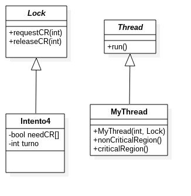

# Problema de exclusión mutua

En **intento 1**, no es posible detectar quien establece el valor *falso* para la variable compartida.

```java
public class Intento1 implements Lock{
  boolean abreAcceso = true;
  public void requestCR(int i){
      while(!abreAcceso){
          abreAcceso = false;
      }
  }
  public void releaseCR(int i){
      abreAcceso = true;
  }
}
```

**Intento 2** almacena para cada Pi verdadero  en needCR[i] y espera a que el otro proceso sea falso. 

```java
public class Intento2 implements Lock{
  boolean abreAcceso = true;
  boolean[] needCR = {false,false};
  public void requestCR(int i){
    needCR[i]=true;
    while(needCR[1-i]){
      needCR[i] = false;
    }
  }
  public void releaseCR(int i){
    needCR[i] = false;
  }
}
```

En **Intento 2**, ambos procesos pueden quedarse esperando a que la CR sea liberada por el otro proceso; **Intento 3** implementa una variable de cambio.

```java
public class Intento3 implements Lock {
  int cambio = 0;
  public void requestCR( int i ) {
      while(cambio==1-i);
  }
  public void releaseCR( int i ) {
      cambio = 1-i;
  }
}
```

**Intento 3** logra la exclusión mutua, pero algunas veces un hilo no puede ganar acceso a la variable compartida y no puede progresar. 

```java
public class Intento3 implements Lock {
  int cambio = 0;
  public void requestCR( int i ) {
      while(cambio==1-i);
  }
  public void releaseCR( int i ) {
      cambio = 1-i;
  }
}
```

**Intento 4** combina los dos intentos anteriores, implementando las banderas **needCR[]** y la variable de cambio.

```java
class Intento4 implements Lock
{
  volatile boolean needCR[] = {false,false};
  int turno = 0;
  public void requestCR( int i ) {
    int x = 1 - i;
    needCR[i]=true;
    turno = x;
    while( needCR[x] && turno == x);
  }
  public void releaseCR( int i ) {
    needCR[i] = false;
  }
}
```

```java
public interface Lock {
    
    public void requestCR(int myid);
    public void releaseCR(int myid);
}
```

```java
import java.util.Random;
import java.util.logging.Level;
import java.util.logging.Logger;

public class MyThread extends Thread{
    int myid;
    Lock lock;
    Random r;
    
    public MyThread(int id, Lock lock){
        myid = id;
        this.lock = lock;
        r = new Random();
    }
    public void nonCriticalRegion() throws InterruptedException{
        int rand = r.nextInt(5000);
        Thread.sleep(rand);
        System.out.println(myid + " no esta en la CR " + rand + " ms");
    }
    public void criticalRegion() throws InterruptedException{
        int rand = r.nextInt(5000);
        //Aqui va el codigo que trabaja con el recurso compartido
        Thread.sleep(rand);
        System.out.println(myid + " esta en la CR " + rand + " ms");
    }
    public void run(){
        while(true){
            try {
                lock.requestCR(myid);
                criticalRegion();
                lock.releaseCR(myid);
                nonCriticalRegion();
            } catch (InterruptedException ex) {
                Logger.getLogger(MyThread.class.getName()).log(Level.SEVERE, null, ex);
            }
        }
    }
    public static void main (String args[]) throws Exception{
        MyThread t[] = new MyThread[2];
        Lock lock = new Intento4();
        for(int i=0; i<2; i++){
            t[i] = new MyThread(i, lock);
            t[i].start();
        }
    }
}
```

